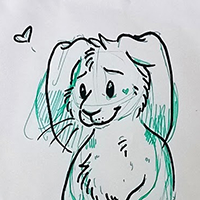
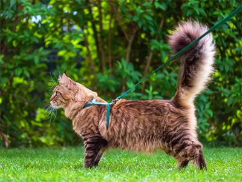
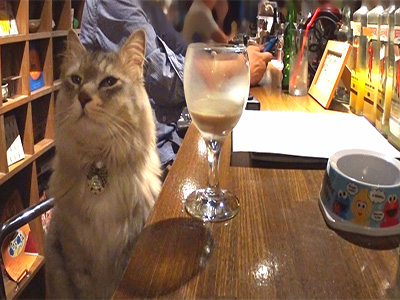
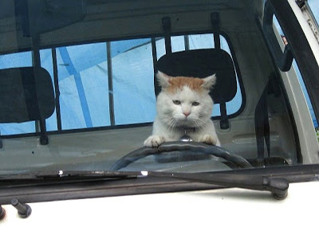

<h1>Arsteakskan language reference, yo!</h1>

### tl;dr:
 * **Arsteakskan** is a fork of Chinese for Chinese and English speakers. Its primary purpose is to serve as an _auxiliary language_ for representing concepts in Chinese or English when one or more aspects of the Chinese meaning are missing (e.g. knowing how to say a character but not write it, knowing what a character looks like but not how to say it, ...).

 * Chinese words and grammar remain largely the same, except for the fact that Arsteakskan does not use tones as a primary method of determining meaning (although it can be explicitly specified). Arsteakskan words get their meaning from the context of the surrounding sentence.

 * There are a few Arsteakskan-specific words and grammar traits which extend Chinese grammar. Many of these are cat noises (it was written as a cat language).

### Bopomofo
**Bopomofo** is a character system designed to represent sounds in Chinese.
In Arsteakskan, it can be used to represent sounds in Chinese _and English,_
and can also be substituted for entire Chinese characters, English words, or transliterated names.

Onomatopoeia is almost exclusively represented as bopomofo, as well as a few
Arsteakskan-specific words which do not exist in Chinese or English.

|**Symbol**|**Sound**|**Example (Chinese)**|**Example (English)**|
|:-:|:-:|:-:|:-:|
|ㄅ|b|**ㄅ**ㄚ (ba) _to hold_|**ㄅ**ㄚㄆ (bap) _bap_|
|ㄆ|p|**ㄆ**ㄠ (pao) _to run_|**ㄆ**ㄠㄋㄙ (paons) _pounce_|
|ㄇ|m|**ㄇ**ㄢ (man) _slow_|**ㄇ**ㄧㄠ (miao) _meow_|
|ㄈ|f|**ㄈ**ㄡ (fou) _no_|**ㄈ**ㄛㄍㄊ (fogt) _forget_|
|ㄉ|d|**ㄉ**ㄢ (dan) _egg_|**ㄉ**ㄛㄍㄡ (dogou) _doggo_|
|ㄊ|t|**ㄊ**ㄡ (tou) _head_|**ㄊ**ㄖㄎㄧ (trki) _turkey_|
|ㄋ|n|**ㄋ**ㄠ (nao) _brain_|**ㄋ**ㄧㄖㄅㄞ (nirbai) _nearby_|
|ㄌ|l|**ㄌ**ㄠ (lao) _old_|**ㄌ**ㄟㄗ (leiz) _laze_|
|ㄍ|g|**ㄍ**ㄡ (gou) _dog_|**ㄍ**ㄖㄟㄊ (greit) _great_|
|ㄎ|k|**ㄎ**ㄢ (kan) _to see_|**ㄎ**ㄚㄊ (kat) _cat_|
|ㄏ|h|**ㄏ**ㄝ (he) _to drink_|**ㄏ**ㄚㄊ (hat) _hat_|
|ㄐ|j|**ㄐ**ㄧㄠ (jiao) _foot_|**ㄐ**ㄇㄆ (jmp) _jump_|
|ㄑ|q|**ㄑ**ㄧㄢ (qian) _money_|**ㄑ**ㄨㄚㄎ (quak) _quack_|
|ㄒ|x|**ㄒ**ㄧㄢ (xian) _wire_|_does not exist in English_|
|ㄓ|zh|**ㄓ**ㄣ (zhen) _real_|_does not exist in English_|
|ㄔ|ch|**ㄔ**ㄡ (chou) _smelly_|**ㄔ**ㄧㄨ (chiu) _chew_|
|ㄕ|sh|**ㄕ**ㄢ (shan) _mountain_|**ㄕ**ㄟㄎ (sheik) _shake_|
|ㄖ|r|**ㄖ**ㄡ (rou) _meat_|**ㄖ**ㄧㄉㄨㄙ (ridus) _reduce_|
|ㄗ|z|**ㄗ**ㄠ (zao) _morning_|**ㄗ**ㄧㄖㄚㄎ**ㄗ** (zirakz) _Xerox_|
|ㄘ|c|**ㄘ**ㄠ (cao) _grass_|_does not exist in English_|
|ㄙ|s|**ㄙ**ㄚ (sa) _to spray_|**ㄙ**ㄟㄌㄧㄋ (seilin) _saline_|
|ㄚ|a|**ㄚ**ㄋ (an) _peace_ |**ㄚ**ㄊ**ㄚ**ㄎ！(atak) _attack!_|
|ㄛ|o|ㄉ**ㄛ** (duo) _many_|ㄧ**ㄛ**ㄋ (ion) _yawn_|
|ㄜ|e|ㄉ**ㄜ** (de) _virtue_|ㄆ**ㄜ**ㄌ (pel) _pill_|
|ㄝ|ê(h)|ㄉㄧ**ㄝ** (die) _to fall_|ㄅ**ㄝ**ㄉ (bed) _bed_|
|ㄞ|ai|ㄎㄨ**ㄞ** (kuai) _fast_|ㄨ**ㄞ**？(uai) _why?_|
|ㄟ|ei|ㄅ**ㄟ** (bei) _north_|ㄙㄊ**ㄟ**ㄎ (steik) _steak_|
|ㄠ|ao|ㄔ**ㄠ** (chao) _noisy_|ㄨ**ㄠ**！(uao) _wow!_|
|ㄡ|ou|ㄔ**ㄠ** (chou) _smelly_|ㄧ**ㄡ**！(iou) _yo!_|
|ㄢ|an|ㄎ**ㄢ** (kan) _to see_|ㄨ**ㄢ**ㄊ (uant) _want_|
|ㄣ|en|ㄕ**ㄣ** (shen) _body_|ㄔㄝㄎ**ㄣ** (cheken) _chicken_|
|ㄤ|ang|ㄎㄨ**ㄤ** (kuang) _crazy_|ㄅ**ㄤ**！(bang) _bang!_|
|ㄥ|eng|ㄕ**ㄥ** (sheng) _life_|ㄙㄊ**ㄥ** (steng) _stung_|
|ㄦ|er|**ㄦ** (er)&ast; _two, and, son, ..._|ㄙㄜㄊ**ㄦ** (seter) _sitter_|
|ㄧ|i|ㄅ**ㄧ** (bi) _pen_|**ㄧ**ㄊ (it) _eat_|
|ㄨ|u|ㄎ**ㄨ** (ku) _to cry_|**ㄨ**ㄧㄋㄦ (uiner) _winner_|
|ㄩ|ü|ㄒ**ㄩ** (xü) _to sympathize_|_does not exist in English_|

&ast; This is an example of one syllable which contains many
character alternatives. The meaning can still be inferred by context, but
if not obvious, Chinese characters can always be specified instead.

### Representing words
Arsteakskan bopomofo is **context-sensitive** -- the meaning of a word is largely dependent on the words around it. This is important, as words can be represented in _two different ways_ using bopomofo: as a representation of the Chinese pronunciation for a Chinese word, and as a representation of the English pronunciation of an English word. In special cases (detailed later), Japanese _kana_ can also be pronounced as Japanese or Arsteakskan based on a subscript marker.

_All_ English words are represented with bopomofo. _Any_ Chinese word can be represented as the original character, as its pronunciation in bopomofo, or as the pronunciation of the English translation of the word in bopomofo.

If bopomofo represents an English pronunciation, there is a many-to-one relationship between bopomofo and English -- as long as it sounds similar, a single English word can be represented multiple ways.

**car**

|  车 | ㄔㄜ | ㄎㄦ | ㄎㄚㄖ |
|:---:|:----:|:----:|:------:|
| che | ch e | k er |  k a r |

Unlike in Chinese bopomofo, Arsteakskan bopomofo tone markers are optional (the character specified by the pronunciation is chosen based on the context), but can be explicitly specified if needed -- particularly, to hint at the intended word when the surrounded context produces multiple alternatives. 

Tone markers are specified below:

| neutral | flat (1) | rising (2) | falling-rising (3) | falling (4) |
|:-------:|:--------:|:----------:|:------------------:|:-----------:|
|    ˙    |     ¯    |      ˊ     |          ˇ         |      ˋ      |

_Note that first tone is represented by ¯, unlike Chinese bopomofo._

###### Example

<b>Jinhai (金海)</b>

 

我要<b>ㄇㄞ(?)</b>ㄆㄨㄊㄠㄧㄡㄙㄆㄨㄋ。 
I'm going to <b>(buy?/sell?)</b> a grapefruit knife. 
wo yao <b>mai</b> pu tao you spun.

---

<b>Jinhai (金海)</b>

 

我要<b>ㄇㄞˇ(✓)</b>ㄆㄨㄊㄠㄧㄡㄙㄆㄨㄋ。 
I'm going to <b>buy</b> a grapefruit knife. 
wo yao <b>mai3</b> pu tao you spun.

---

<b>Fei (林飞)</b>

 

ㄎㄨ！我会<b>卖(✓)。</b> 
Cool! I can <b>sell</b> one to you. 
ku! wo hui <b>mai4.</b>

---

As demonstrated above, Chinese words in Arsteakskan are **context-free** -- they maintain their original Chinese meaning regardless. The practical effect is that if there is any trouble remembering a particular Chinese character or pronunciation, multiple alternatives to represent that concept are available.

### A few more bopomofo examples
Words along the same row have the same meaning.

| Chinese |  English  |  Bopomofo  | Also bopomofo |
|:-------:|:---------:|:----------:|:--------:|
|   攻击  | to attack | ㄍㄨㄥㄐㄧ g u eng j i | ㄚㄊㄚㄎ a t a k |
|   保护  | to protect | ㄅㄠㄏㄨ b ao h u | ㄆㄖㄡㄊㄝㄎ p r ou t e(h) k |
|   鸡块  | chicken nuggets | ㄐㄧㄎㄨㄞ j i k u ai | ㄔㄝㄎㄣㄋㄜㄍㄊㄙ ch e(h) k en n e g t s |
|   牛排  | beef steak | ㄋㄧㄡㄆㄞ n i u p ai | ㄙㄊㄟㄎ s t ei k |

The following sentences all have the same meaning. The word to represent as bopomofo was arbitrarily chosen, and each letter split apart for emphasis.

<strong><i>I walked my cat.</i></strong>  

我跟我猫走路。 
wo gen wo mao zou lu 
我ㄍㄣ我ㄇㄠ¯走ㄌㄨ。 
wo gen wo mao1 zou <b>l u</b> 
我ㄍㄣ我ㄎㄝㄊㄗㄡ路。 
wo gen wo <b>k a t z ou</b> lu

 

---

<strong><i>I could still be at my house, unless I went to the bar.</i></strong>  

我可以还在我家里，否则我去酒吧。 
wo ke yi hai zai wo jia li, fou ze wo qu jiu ba 
我可以还在我家里，否ㄗㄜ我去ㄐㄧㄡㄅㄚ。 
wo ke yi hai zai wo jia li, fou <b>z e</b> wo qu <b>j i u b a</b> 
我可以还在我ㄐㄧㄚ里，ㄈㄡ则我去ㄅㄦ。 
wo ke yi hai zai wo <b>j ia</b> li, <b>f ou</b> ze wo qu <b>b er</b> 

 

---

<strong><i>I hate Mondays, and love lasagna.</i></strong>  

我恨星期一，爱吃千层面。 
wo hen xing qi yi, ai chi qian ceng mian 
我恨ㄒㄧㄥㄑㄧ一，ㄞ吃千ㄘㄥ面。 
wo hen <b>x i eng q i</b> yi, ai chi qian <b>c eng</b> mian 
我恨ㄇㄣㄉㄟㄙ，ㄞ吃ㄌㄚㄙㄚㄍㄚ。 
wo hen <b>m en d ei s</b>, ai chi <b>l a s a g a</b>

 

---

#### Kana
Japanese _kana_ can also be used as a pronunciation alternative for Chinese characters, and can be read multiple ways. This is denoted by a **subscript.**

* If the subscript is 1 or omitted, the character is pronounced _in the language that it is written._

* If the subscript is 2, the character is pronounced _opposite to the language that it is written_ (i.e. kana is pronounced as Chinese or Chinese is pronounced as kana).

This system happens almost exclusively with 的/の and 嘻/へ:

| Arsteakskan |  Pronunciation  |  Arsteakskan |  Pronunciation  |
|:-----------:|:---------------:|:-----------:|:---------------:|
|**の(1)**| <i>nou</i> (ㄋㄡ) | **へ(1)**| <i>he(h)</i> (ㄏㄝ) |
|**の2**| <i>de</i> (ㄉㄜ) | **へ2**| <i>xi</i> (ㄒㄧ)
|**的(1)**| <i>de</i> (ㄉㄜ) | **嘻(1)**| <i>xi</i> (ㄒㄧ) |
|**的2**| <i>nou</i> (ㄋㄡ) | **嘻2**| <i>he(h)</i> (ㄏㄝ) |

In all cases, the meaning remains exactly the same.

###### Example

<strong><i>My freakin' car is broken. Heh, typical.</i></strong>  

我ㄈㄖㄧㄎㄣ<b>の</b>车已ㄏㄨㄞ。
<b>へ</b>，特有<b>的</b>。 
wo friken <b>nou</b> che yi huai. <b>he,</b> te you <b>de.</b> 
我ㄈㄖㄧㄎㄣ<b>の2</b>车已ㄏㄨㄞ。<b>嘻2</b>，ㄊㄜ有<b>的2</b>。 
wo friken <b>de</b> che yi huai. <b>he,</b> te you <b>nou.</b>
   <!-- Missing 3-line padding -->

---

### Arsteakskan-specific words

Not all words in Arsteakskan come from Chinese or English -- some words stand on their own. Some are slang, while others are particles used specific to the context of the sentence.

Particles must be used either at the end of a sentence, or as a standalone expression. Words marked as _free_ below can be inserted _anywhere_ in a sentence.

| Phrase | Pronunciation | Usage/Definition | Phrase | Pronunciation | Usage/Definition |
|:-----------:|:-------------:|:-----:|:-----------:|:-------------:|:-----:|
|   **ㄏㄡㄧ**    |     houi      | hello | **ㄇㄖㄠ**      |    mrao       | _free_
|   **ㄏㄥ**    |     heng      | arousal particle | **ㄇㄖㄝ**      |    mre(h)     | 没办法 particle&ast;|
|   **ㄇㄧㄠ**    |     miao      | _free_ | **ㄋㄧㄚ**     |    nia       | _free_|
| **ㄇㄧㄡㄋ？**   |     mioun?   | question particle | **ㄋㄧㄚㄋ**    |    nian       | _free_|
| **ㄇㄧㄡ？**     |     miou?    | question particle | **ㄋㄧㄝ！**    |    nye(h)!       | jeering particle|
| **ㄇㄧㄚ**      |     mia       | _free_ | **ㄖㄚ！**      |    ra!       | attacking particle|
| **ㄇㄧㄚㄢ**    |     mian      | person, dude | **ㄖㄠ**      |    rao       | _free_|
| **ㄇㄖㄨ！**    |     mru!       | excitement particle | **ㄖㄝ**      |    re(h)       | disgust particle|

&ast; 没办法 (mei ban fa) is an expression which conveys acceptance with a less-than-ideal situation because "nothing can be done about it."

###### Example

<b>Jinhai (金海)</b>

 

<b>ㄏㄡㄧ，</b>你ㄗㄣ么ㄧㄤ？ 
Hey, how's it going? 
<b>houi,</b> ni zen me yang?

---

<b>Fei (林飞)</b>

 

我是ㄡㄎㄟ。你ㄜ<b>ㄇㄧㄡ？</b> 
I'm OK. Are you hungry? 
wo shi oukei. ni e <b>miou?</b>

---

<b>Jinhai (金海)</b>

 

<b>ㄇㄧㄚ，</b>从早上没吃东西<b>ㄋㄧㄚ</b>。 
Mya, I haven't eaten since this morning, nyaa. 
<b>mia,</b> cong zao shang mei chi dong xi <b>nia</b>.

---

<b>Fei (林飞)</b>

 

<b>ㄇㄧㄡㄋ？</b> ㄨㄞ？ 
Huh? Why? 
<b>myoun?</b> oai?

---

<b>Jinhai (金海)</b>

 

因为有人把很多很多ㄊㄖㄡㄈㄧ往ㄏㄜㄉ下ㄙㄞ¯了。它ㄏㄨㄞ了。 
'Cause someone took a bunch of trophies and stuffed 'em under the hood of my car. It broke. 
yin wei you ren ba hen duo hen duo troufi wang houd xia sai1 le. ta huai le.

---

<b>Fei (林飞)</b>

 

ㄨ～，我想我ㄓ道ㄕㄟㄗㄨㄛ！ 
Oooooh, I think I know who did it! 
u~, wo xiang wo zhi dao shei zuo!

---

<b>Jinhai (金海)</b>

 

<b>ㄖㄝ。</b>我ㄍㄢˇ说。 
Reh. I bet you do. 
<b>re(h).</b> wo gan3 shuo.

